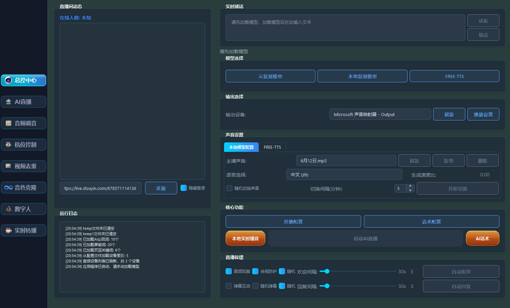
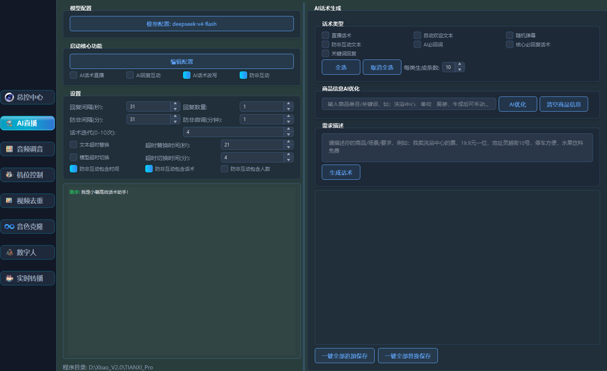
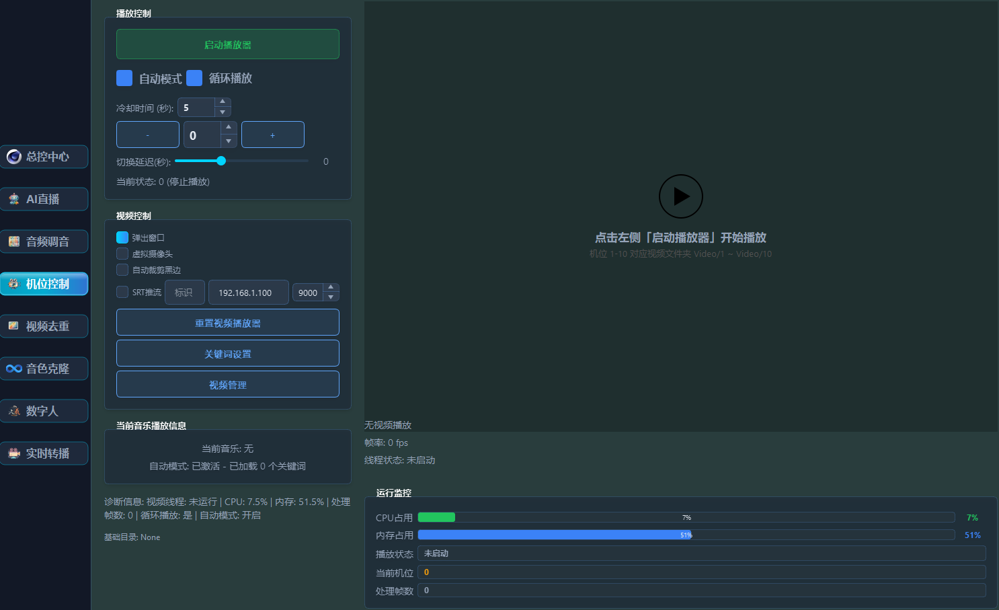
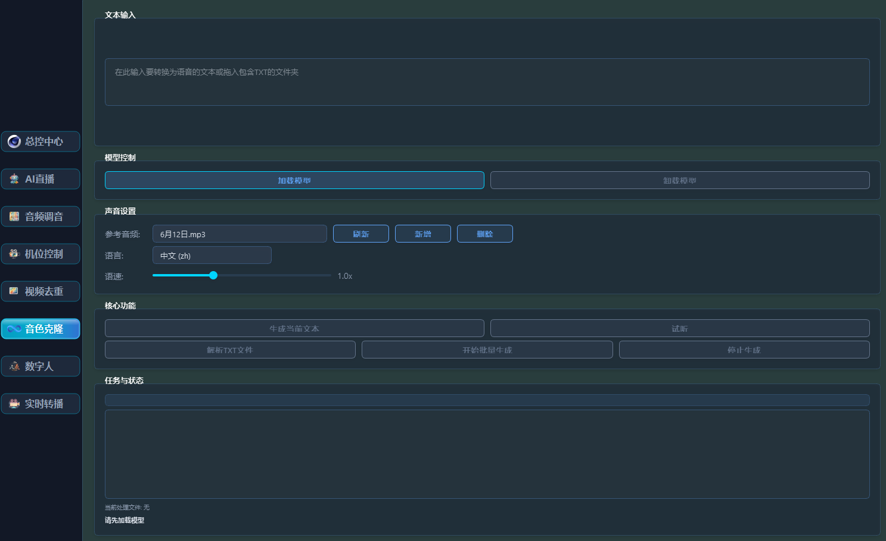
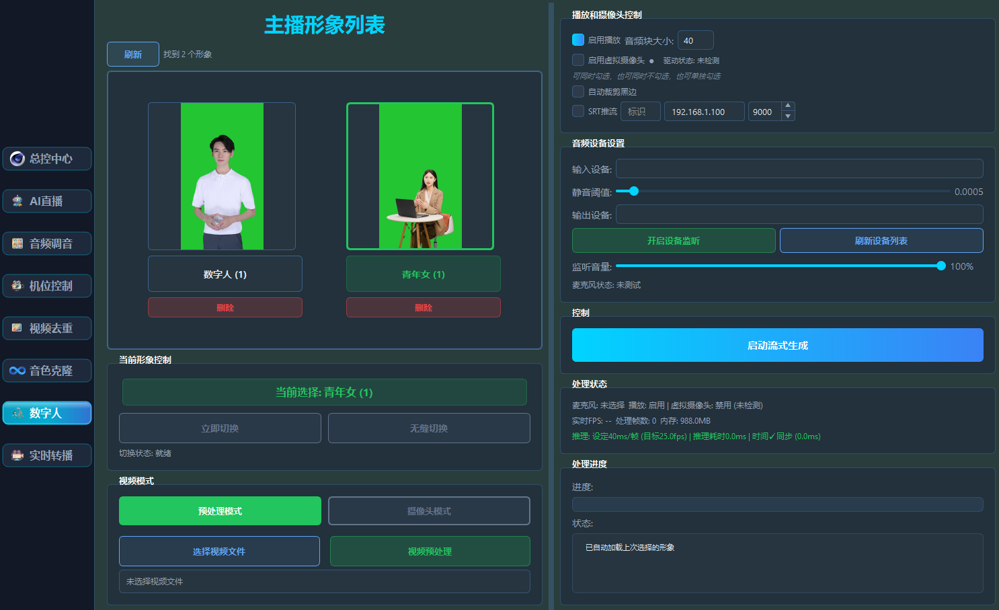
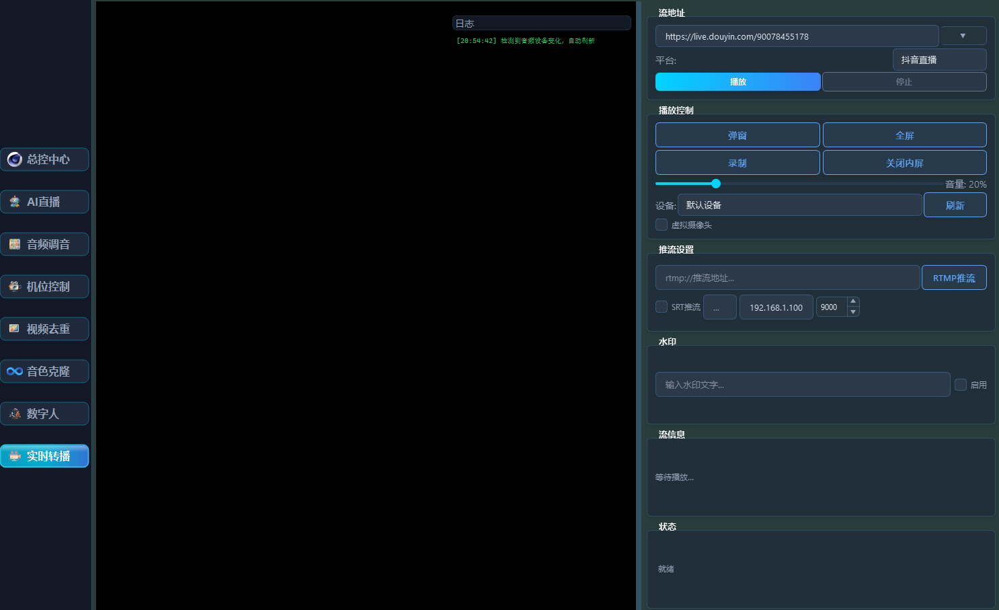
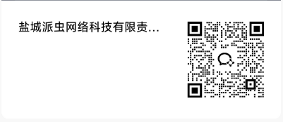

# 泡泡直播 Paopao Live · AI 数字人直播软件

> **重要声明（必读）**
> - 本软件为 **收费商业软件**：**不开源、无免费版、无试用版**。
> - 本公开 GitHub 仓库仅用于：产品介绍、演示截图、版本下载（Releases）、Issue 反馈。
> - **核心源码永不放入本仓库**。源码、构建脚本、授权服务器均存放于私有仓库。
> - 运营主体：**泡泡文化**。文中价格、购买链接、联系方式均为真实信息，如有变动以最新版本为准。

---

## 📺 泡泡直播是什么

泡泡直播是一款面向电商商家与内容创作者的 **桌面端数字人直播工具**：

- 🧑‍🎤 **你的数字人**：上传人脸照片与语音样本，生成专属数字人形象（本地处理，原文件不上传服务器）
- 🗣 **实时语音合成**：TTS 驱动数字人口型同步说话，支持多音色
- 🕐 **7×24 无人直播**：脚本轮播 + 自动回复评论 + 定时发券播报
- 📡 **多平台推流**：支持 OBS / 推流工具接入抖音、快手、淘宝等平台（是否允许数字人直播以各平台最新规则为准）
- 📋 **话术管理**：商品口播、互动话术、应急预案一键切换
- 🏢 **多账号管理**：专业版/企业版支持多直播间并行管理

## ✨ 功能亮点

| 能力 | 说明 |
|---|---|
| 形象克隆 | 照片级数字人，口型自然，表情可控 |
| 语音克隆 | 3~5 分钟语音样本即可克隆音色 |
| 直播脚本引擎 | 分时段脚本、商品列表、自动互动 |
| 评论互动 | 自动识别高频问题并语音回复（可配关键词） |
| 断流保护 | 网络异常自动重连，直播不中断 |
| 内容合规 | 内置 AI 生成内容显式+隐式标识（符合《人工智能生成合成内容标识办法》要求） |

## 🖼 产品截图

| 主界面 | 形象编辑 | 语音克隆 |
|---|---|---|
|  |  |  |

| 脚本引擎 | 评论互动 | 许可证激活 |
|---|---|---|
|  |  |  |

## 💰 价格（仅收费）

| 版本 | 价格 | 有效期 | 包含内容 |
|---|---|---|---|
| **试用版** | ¥50 / 天 | 1 天 | 完整功能体验，适合短期活动或临时补位 |
| **企业版** | ¥5,000 | 永久 | 不限数字人/账号、私有化部署、离线授权、专属支持 |

- 购买入口：[https://pan.baidu.com/s/5HWb97t2iI5p8TDAGuo0N9A#list/path=%2F](https://pan.baidu.com/s/5HWb97t2iI5p8TDAGuo0N9A#list/path=%2F)
- 付款支持支付宝 / 微信；企业客户可开具发票（电子普票 / 专票），如需专票请联系客服。
- 价格与权益以购买页当期公示为准，企业版续期/增购权益请咨询客服。

## 🖥 系统要求

| 项目 | 要求 |
|---|---|
| 操作系统 | Windows 10/11 64 位，或 macOS 12+（Apple Silicon / Intel） |
| 显卡 | 推荐 NVIDIA 独显（显存 ≥ 4GB）；无独显可启用「云端渲染」模式 |
| 内存 | 16GB 及以上 |
| 磁盘 | ≥ 20GB 可用空间 |
| 网络 | 上行带宽 ≥ 10Mbps（推流需求） |

## 📥 安装

### 方式一：手动下载（推荐）

1. 前往 [Releases](https://github.com/sjh74688-king/digital-human-live/releases) 下载与你系统匹配的最新安装包；
2. **Windows**：双击 `PaopaoLive-Setup-x64.exe` 按向导安装；
   **macOS**：拖入「应用程序」文件夹。若被 Gatekeeper 拦截：右键 → 打开 → 打开；
3. 启动软件，在「许可证」页面输入 License Key 激活（见下一节）。

### 方式二：一键安装脚本

脚本只做三件事：从 GitHub Releases 拉取**官方签名安装包** → 校验 SHA-256 → 静默安装。**不会下载或安装任何源码**。

**Windows**（PowerShell，以管理员身份运行）：

```powershell
iwr -useb https://raw.githubusercontent.com/sjh74688-king/digital-human-live/main/scripts/install.ps1 -OutFile $env:TEMP\xl.ps1; powershell -ExecutionPolicy Bypass -File $env:TEMP\xl.ps1
```

**macOS / Linux**：

```bash
curl -fsSL https://raw.githubusercontent.com/sjh74688-king/digital-human-live/main/scripts/install.sh | bash
```

## 🔑 购买与激活

1. 选择版本并付款：[https://pan.baidu.com/s/5HWb97t2iI5p8TDAGuo0N9A#list/path=%2F](https://pan.baidu.com/s/5HWb97t2iI5p8TDAGuo0N9A#list/path=%2F)；
2. 付款成功后 License Key 发送至订单邮箱（通常 5 分钟内），同时客服会通过微信确认；
3. 打开软件 →「许可证」→ 输入 Key + 订单邮箱完成激活（在线验证，断网可续期 7 天内补激活）；
4. 企业版支持**离线激活**与**私有化部署**，联系客服；
5. 发票：将订单号发送至客服邮箱 <1169202852@qq.com>，3 个工作日内开出。

## ❓ 常见问题

- **Q：有免费版吗？** A：没有免费版。有 **¥50/天** 的试用版可完整体验全部功能，按天计费、随用随买。
- **Q：企业版是永久买断吗？** A：是。**¥5,000 永久使用**，含不限数字人/账号、私有化部署与离线授权；后续大版本升级权益请咨询客服。
- **Q：一台电脑 / 一个 Key 能装几台？** A：以所购版本的并发激活数为准，超额激活会被吊销，续费可恢复。
- **Q：可以退款吗？** A：自付款之日起 7 天内且未激活使用的订单可全额退款，已激活的按《服务条款》执行。
- **Q：能上抖音 / 快手吗？** A：软件提供推流能力；你的类目是否允许数字人直播、需要哪些报备，以平台最新规则为准，使用前请自行确认。
- **Q：AI 内容标识能关吗？** A：不能。依据《人工智能生成合成内容标识办法》（2025-09-01 施行），显式+隐式标识为强制功能。
- **Q：续费怎么办？** A：到期前 30 天邮件提醒；续费后原 Key 自动延长，无需重新部署。

## ⚖️ 合规提示（重要）

使用本产品从事数字人直播，请遵守以下要求（**均以官方最新口径为准，发布前请逐项复核**）：

1. **生成式 AI 备案**：如你面向公众提供生成式 AI 相关服务，可能需按《生成式人工智能服务管理暂行办法》办理备案/登记；
2. **深度合成**：数字人属深度合成应用，请遵守《互联网信息服务深度合成管理规定》，对使用人进行实名核验并提示义务；
3. **AI 内容标识**：《人工智能生成合成内容标识办法》已于 2025-09-01 施行，直播画面中的 AI 生成内容必须加显式标识，数据层需加隐式标识（本软件已内置，请勿绕过）；
4. **肖像与声音授权**：使用真人形象/声音生成数字人，须取得本人书面授权（本软件激活流程内置授权确认）；
5. **平台规则**：抖音、快手、淘宝等对数字人直播有专门规则（如报备、限流、禁止类目），以平台最新规则为准；
6. **ICP 与软著**：官方运营主体应完成 ICP 备案、软件著作权登记，建议同步办理。

## 📄 许可与法律文件

- [LICENSE](./LICENSE) — 商业许可协议（简版）
- [LEGAL/EULA.md](./LEGAL/EULA.md) — 最终用户许可协议
- [LEGAL/PRIVACY.md](./LEGAL/PRIVACY.md) — 隐私政策
- [LEGAL/TERMS.md](./LEGAL/TERMS.md) — 服务条款（购买/退款/支持）

**你下载、安装或使用本软件，即视为同意上述全部文件。**

## 📮 支持

- 🐛 Bug 报告 / 建议：[GitHub Issues](https://github.com/sjh74688-king/digital-human-live/issues)（请勿在 Issue 中贴 License Key、支付信息）
- ✉️ 客服邮箱：<1169202852@qq.com>
- 💬 客服微信（购买/售后/发票，扫码添加）：

  

- 付费客户享受优先响应（试用版 24h 内，企业版 2h 内，工作时间）。

---

## 关于泡泡文化

泡泡文化（Bubble Culture）专注数字人直播技术研发，提供从数字人形象生成、语音克隆到无人直播的完整工具链。

---

## 📋 上架前仍需补全（可选）

| 占位符 | 说明 |
|---|---|
| 【公司全称】 | 如「营业执照上的公司全称」非「泡泡文化」，请替换 LEGAL 三个文件中的该占位 |
| 价格 / 链接 | 已在正文更新，若后续变动同步此处即可 |
| 截图 | 已放 `assets/screenshots/` 6 张 + 微信二维码 `assets/wechat-qr.png` |
